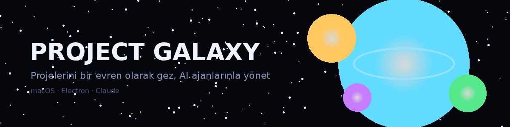
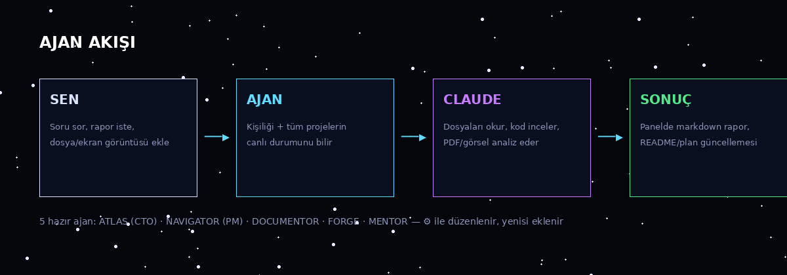

<p align="center">
  
</p>

<h1 align="center">Project Galaxy</h1>
<p align="center"><b>Bilgisayarındaki projeleri bir evren olarak gez, yapay zekâ ajanlarınla yönet.</b><br>
macOS · Electron · React · Claude</p>

---

## Bu uygulama ne işe yarar?

Diyelim ki diskinde onlarca proje klasörü var: kimi yarım, kimi bitmiş, kiminde ne kaldığını hatırlamıyorsun bile. Project Galaxy bu klasörleri **yaşayan bir evrene** çevirir:

- Her klasör bir **gezegen** olur — rengi durumunu (aktif/beklemede/bitti), halkası ilerlemesini, parlaklığı git aktivitesini gösterir. İhmal ettiklerin sarı ünlemle sana bakar.
- Gezegene "inersin": dosyaların yörüngede döner, README'si yanında, planın solunda, altta Claude'a ve bash'e komut verdiğin konsol.
- **5 kişisel AI ajanın** (CTO, PM, Dokümantasyoncu, Kod Denetçisi, Koç) projelerinin gerçek durumunu görerek rapor verir, README yazar, hesap sorar.
- Notların, todo'ların, günlüğün — hepsi projelere bağlanır ve README dosyalarına **senin onayınla** işlenir.

**Kazanımın:** dağınık klasörler yerine tek bakışta durum; unutulan işlerin bitmesi; dokümantasyonun kendini yazması; ve her şeyin git + yedeklerle güvende olması. Verilerin hiçbir sunucuya gitmez — her şey diskinde.

---

## Kurulum (hiç bilmeyenler için)

**Gerekenler:** macOS ve 10 dakika.

**Adım 1 — Node.js kur** (uygulamanın motoru):
[nodejs.org](https://nodejs.org) adresinden "LTS" düğmesiyle indir, kurulum sihirbazını tamamla.

**Adım 2 — Claude Code kur** (ajanların beyni):
Terminal'i aç (⌘+Boşluk → "Terminal") ve şunu yapıştır:
```bash
npm install -g @anthropic-ai/claude-code
claude   # ilk çalıştırmada hesabınla giriş yapmanı ister
```

**Adım 3 — Uygulamayı paketle** (tek seferlik):
`ProjectGalaxy` klasöründeki **`Gerçek App Oluştur.command`** dosyasına çift tıkla.
macOS "tanımlanamayan geliştirici" derse: dosyaya **sağ tık → Aç → Aç**.
Script birkaç dakikada bağımlılıkları indirir ve bir üst klasöre **Project Galaxy.app** üretir.

**Adım 4 — Aç ve kullan:**
`Project Galaxy.app`'e çift tıkla (ilk sefer yine sağ tık → Aç gerekebilir). Dock'ta sağ tık → Seçenekler → **Dock'ta Tut** ile sabitle.

> Güncellemelerde: yalnızca arayüz değiştiyse uygulamayı kapat-aç yeterli; `main.js` değiştiyse Adım 3'ü bir kez tekrarla.

---

## İlk 10 dakika — rehberli tur

<p align="center"></p>

1. **Evrenini seç.** Açılışta İş / Kişisel kartları çıkar. ✎ ile ad/klasör değiştir, **+** ile bilgisayarındaki herhangi bir klasörü yeni evren yap — içindeki her alt klasör otomatik gezegen olur.
2. **Gezin.** Fareyle sürükle, tekerlekle yaklaş. Soldaki listeden tek tık = projeye uç, çift tık = gezegene in. Sağ alttaki Sektör Haritası'na tıkla = ışınlan.
3. **Renkleri oku.** 🔵 aktif · 🟡 beklemede · 🟢 tamam · ⚪ arşiv · 🟣 keşfedilmemiş (yeni klasör). Sarı **!** = 21+ gündür dokunulmamış aktif proje. Gezegenler arası akan çizgiler = bağladığın ilişkili projeler.
4. **Bilgi kartı.** Gezegene tek tıkla: aşama, ilerleme, git satırı (`⎇ dal · son commit · ▸ GEÇMİŞ`). "Gezegene İn ▸" ile içeri gir.
5. **?'ye bas.** Üst bardaki soru işareti 10 slaytlık görselli rehberi açar — bu turun uygulama içi hali.

### Gezegenin içi

<p align="center"></p>

- **Orta:** dosyaların yörüngede. Klasör = halkalı uydu (tıkla → içine dal), dosya = türüne göre renkli (kod mavi, doküman sarı, görsel pembe). Tıklayınca **uygulama içinde** açılır: kod, markdown, resim, PDF, video. Üstte "belgede ara…" kutusu vurgulu arama yapar.
- **Sol panel:** KAYIT (durum, ilerleme, plan checklist'i — çift tıkla düzenle, notlar, odak kronometresi, onaylı proje kaldırma) · AĞAÇ (tam dosya ağacı) · **⎇ GİT** (dallar, commit'lenmemiş değişiklikler, commit zaman çizgisi).
- **Sağ panel:** README her zaman açık, render'lı.
- **Alt konsol, iki sekme:**
  - **⌁ CLAUDE** — "şu bug'ı düzelt" yaz, Enter. Claude'un dokunduğu dosyalar yörüngede amber yanar; ekran görüntüsü **yapıştır** (⌘V) veya dosya **sürükle**, görerek analiz eder.
  - **▮ BASH** — gömülü terminal. `cd`, ortam değişkenleri oturum boyunca korunur; ↑↓ komut geçmişi; ⟲ sıfırla; ⇗ Terminal.app'te aç.

### Ajanların

<p align="center"></p>

Sağ üstteki istasyonda dururlar; üzerine gel → görev kartı, tıkla → konuşma paneli. **Uzaydayken tüm evrene, gezegen modundayken sadece o projeye** bakarlar (panelde BAĞLAM çipi).

| Ajan | Rolü | Ona ne dersin |
|------|------|----------------|
| 🔵 **ATLAS** | CTO | "İş evreninin durum raporunu ver", "Risk analizi yap" |
| 🟡 **NAVIGATOR** | PM | "Standup", "İhmal ettiklerim neler?" — rozetinde uyarı sayısı birikir |
| 🟢 **DOCUMENTOR** | Dokümantasyon | "Bu projeye README yaz" — dosya yazabilen tek ajan |
| 🩷 **FORGE** | Kod kalitesi | "Teknik borcu tara" — okur ama asla değiştirmez |
| 🟣 **MENTOR** | Kişisel koç | "Bu hafta için çalışma planı öner" |

⚙ düğmesiyle adlarını, renklerini, görev tanımlarını ve hazır komut düğmelerini düzenler, yeni ajan eklersin.

### Günlük iş akışın

- **✎ GÜNLÜK:** "login ekranını bitirdim" yaz → uygulama hangi projeyle ilgili olduğunu bulur → **klasör yolunu göstererek onayını ister** → yapılan iş README `## Günlük`e, yapılacak iş `## Yapılacaklar`a ve plana işlenir. README'deki `- [ ]` maddeleri de gezegene girince plana aktarılır — çift yönlü senkron.
- **▦ PANO:** tüm todo'lar Trello tarzı üç kolonda (Bekliyor / Devam / Tamam). Karttan ▸ GİT ile gezegene in, ⌁ ile Claude aç.
- **⏱ ZAMANLAYICI:** "her sabah 09:00'da ATLAS durum raporu hazırlasın" gibi görevler; çıktılar rapor arşivine düşer, ekranda bildirim çıkar.
- **⌘⇧G:** uygulama kapalıyken bile menü çubuğundan hızlı not.
- **⛁ DB:** veritabanı sunucularını ekle (parolalar Anahtar Zinciri'yle şifreli) → sunucudaki tüm veritabanları → tablolar → satırlar; **ŞEMA** düğmesi tablo ilişkilerini (foreign key) kart diyagramı olarak çizer. Yalnızca okuma — veri bozamazsın.

---

## Verilerim güvende mi?

- Her şey diskinde: tek veri dosyası `galaxy-data.json`. Hiçbir bulut yok.
- Her gün otomatik yedek (`backups/`, 14 gün) + her değişiklikte sessiz **git commit** — `git log` ile zaman yolculuğu.
- Proje silme iki aşamalı onaylıdır ve en kötü ihtimalle macOS Çöp Kutusu'na gider; kalıcı silme yoktur.
- DB parolaları macOS `safeStorage` ile şifrelenir; DB tarafında yalnızca `SELECT` çalışır.

## Sık sorulanlar

**Uygulama açılmıyor.** İlk açılışta sağ tık → Aç (Gatekeeper). Hâlâ olmuyorsa Node.js kurulu mu kontrol et: Terminal'de `node -v`.

**Ajanlar "claude bulunamadı" diyor.** Adım 2'yi yap; sonra `claude` yazıp giriş yaptığından emin ol.

**Yeni eklediğim klasör görünmüyor.** 60 saniye bekle ya da pencereye tıkla (odaklanınca tarar). Uzay modundayken görünür.

**Bir şeyi yanlışlıkla değiştirdim.** `backups/` klasöründen dünkü `galaxy-data-*.json`'u geri kopyala veya `git checkout <hash> -- galaxy-data.json`.

**vim/top gömülü terminalde çalışmıyor.** Doğru — o bir komut yürütücü, tam ekran programlar için ⇗ ile gerçek Terminal'i aç.

## Klasör yapısı & mimari (meraklısına)

```
ProjectGalaxy/
├── main.js              # Electron ana süreç — tarama, git, ajanlar, DB, zamanlayıcı (50+ IPC)
├── preload.js           # Güvenli köprü (window.galaxy.*)
├── index.html           # Derlenmiş React arayüzü (kaynaktan üretilir, elle düzenleme)
├── galaxy-data.json     # TÜM verin — tek kaynak
├── docs/                # Bu README'nin görselleri
├── backups/  reports/  attachments/  build/
└── Gerçek App Oluştur.command   # paketleyici (mimarini otomatik algılar)
```

Teknik notlar: Canvas 2D sahne (sprite önbelleği + katman-başına-tek-path yıldızlar sayesinde 60fps), ajanlar `claude -p --output-format stream-json` alt süreci olarak akar, git bilgisi süreç başlatmadan `.git` dosyalarından okunur, DB sürücüleri saf JS (pg/mysql2/sql.js). Ürünleştirme yol haritası için `PRODUCTIZATION.md`.

## Kısayollar

| | |
|---|---|
| **ESC** | katman katman geri | 
| **Enter** | gönder/çalıştır (her konsol ve ajan kutusunda) · **Shift+Enter** yeni satır |
| **⌘⇧G** | her yerden hızlı not |
| **Çift tık** | gezegene in · plan maddesi düzenle |
| **↑↓** | bash komut geçmişi · **⌫** üst klasör |
| **WASD/oklar, +/−, ⌂** | uzayda gezinme |
