<p align="center">
  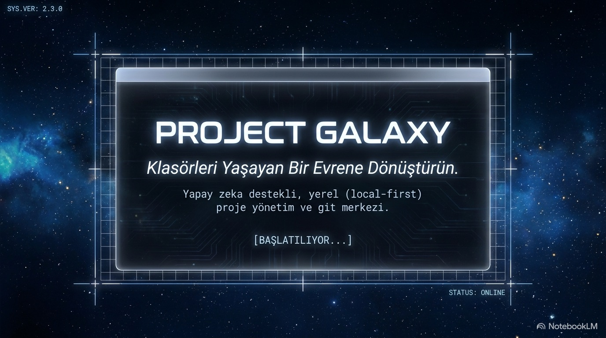
</p>

<h1 align="center">Project Galaxy</h1>
<p align="center"><b>Bilgisayarındaki projeleri bir evren olarak gez, yapay zekâ ajanlarınla yönet, tek pencereden geliştir.</b><br>
macOS · Electron · Claude Code · v2.3.9</p>

---

## İçindekiler

- [Bu uygulama ne işe yarar?](#bu-uygulama-ne-i̇şe-yarar)
- [Kurulum (hiç bilmeyenler için)](#kurulum-hiç-bilmeyenler-için)
- [Terminoloji — galaksi · yıldız sistemi · gezegen](#terminoloji--galaksi--yıldız-sistemi--gezegen)
- [Arayüz turu](#arayüz-turu)
  - [Üst bar & navigasyon](#üst-bar--navigasyon)
  - [İstasyon Araçları (saat · takvim · hesap · hızlı ara)](#i̇stasyon-araçları)
  - [Uzay modu — galaksi haritası](#uzay-modu--galaksi-haritası)
  - [Gezegen modu — projenin içi](#gezegen-modu--projenin-i̇çi)
  - [Konsol — kalıcı bash + Claude oturumları](#konsol--kalıcı-bash--claude-oturumları)
  - [🔮 Galaxy Asistanı — dijital ikizin](#-galaxy-asistanı--dijital-ikizin)
  - [GİT — canlı panel + Git Merkezi](#gi̇t--canlı-panel--git-merkezi)
- [Sekmeler](#sekmeler)
  - [PANO (Kanban)](#-pano--kanban)
  - [DB (Veritabanı gezgini)](#-db--veritabanı-gezgini)
  - [DOCKER](#-docker)
  - [ZAMANLAYICI](#-zamanlayıcı)
  - [SUNUCULAR (Uzak / SSH)](#-sunucular--uzak--ssh)
- [Yapay zekâ ajanların](#yapay-zekâ-ajanların)
- [Ayarlar](#ayarlar)
- [Kısayollar](#kısayollar)
- [Verilerim güvende mi?](#verilerim-güvende-mi)
- [Sık sorulanlar](#sık-sorulanlar)
- [Klasör yapısı & mimari](#klasör-yapısı--mimari-meraklısına)
- [Sürüm notları — bu sürümde neler değişti](#sürüm-notları--bu-sürümde-neler-değişti)

---

## Bu uygulama ne işe yarar?

<p align="center">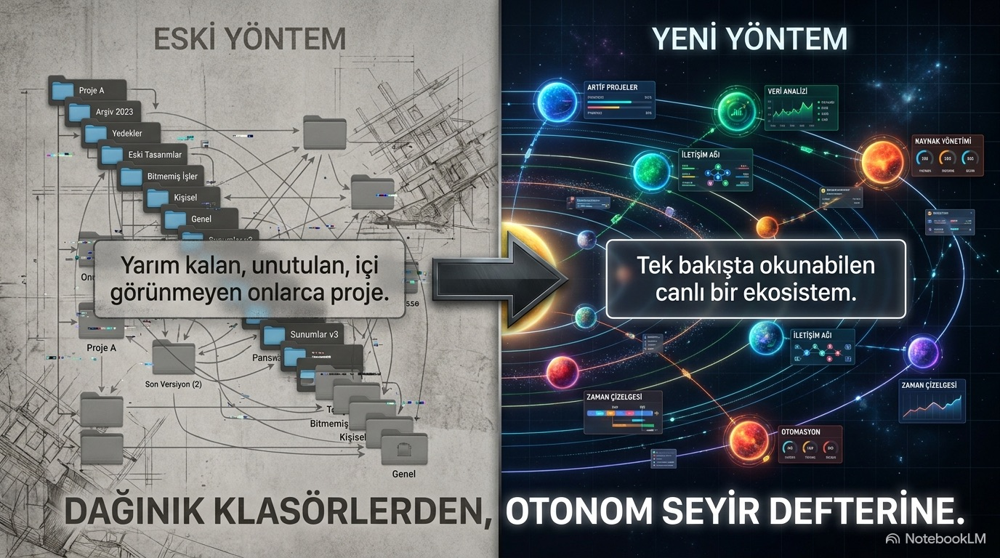</p>

Diskinde onlarca proje klasörü var: kimi yarım, kimi bitmiş, kiminde ne kaldığını hatırlamıyorsun bile. Project Galaxy bu klasörleri **yaşayan bir evrene** çevirir ve üstüne günlük geliştirme için ihtiyacın olan araçları (terminal, Claude, git, DB, Docker, uzak sunucu, zamanlayıcı) **tek pencerede** toplar:

- Her git deposu bir **gezegen** olur — rengi durumunu, halkası ilerlemesini, konumu son aktivitesini gösterir.
- Gezegene "inersin": dosyaların yörüngede döner, README'si sağında, planın solunda, altta **projeye özel, kalıcı** bir terminal (bash + Claude) çalışır.
- **5 kişisel AI ajanın** (CTO, PM, Dokümantasyoncu, Kod Denetçisi, Koç) projelerinin gerçek durumunu görerek rapor verir, README yazar, hesap sorar.
- Notların, todo'ların, günlüğün — hepsi projelere bağlanır ve README dosyalarına **senin onayınla** işlenir.
- Verilerin hiçbir sunucuya gitmez — her şey diskinde, git + yedeklerle güvende.

---

## Kurulum (hiç bilmeyenler için)

**Gerekenler:** macOS ve ~10 dakika.

**Adım 1 — Node.js *veya* Bun kur** (uygulamanın motoru):
[nodejs.org](https://nodejs.org) → "LTS" ile indir. (Alternatif ve daha hızlı: [bun.sh](https://bun.sh). Paketleyici otomatik olarak bun'ı tercih eder.)

**Adım 2 — Claude Code kur** (ajanların ve ⌁ CLAUDE konsolunun beyni):
Terminal'i aç (⌘+Boşluk → "Terminal") ve yapıştır:
```bash
npm install -g @anthropic-ai/claude-code
claude   # ilk çalıştırmada hesabınla giriş yapmanı ister
```

**Adım 3 — Uygulamayı paketle** (tek seferlik):
`ProjectGalaxy` klasöründeki **`create_app.command`** dosyasına çift tıkla.
macOS "tanımlanamayan geliştirici" derse: dosyaya **sağ tık → Aç → Aç**.
Script bağımlılıkları indirir, arayüzü derler (`newui/build.py`) ve bir üst klasöre **Project Galaxy.app** üretir, ad-hoc imzalayıp karantinayı temizler.

> Paketlemeden hızlıca denemek için: **`Başlat.command`** dosyasına çift tıkla — uygulamayı doğrudan kaynak koddan açar.

**Adım 4 — Aç ve tanış:**
`Project Galaxy.app`'e çift tıkla (ilk sefer yine sağ tık → Aç gerekebilir). İlk açılışta uygulama seni **bir defalığına tanır**: dil (TR/EN), adın (ajanlar sana ismiyle hitap eder), proje klasörlerin (her biri bir evren) ve 5 ajanının kişiselleştirmesi. Bu ekran bir daha çıkmaz — hepsi sonradan **⚙ Ayarlar**'dan değişir. Dock'ta sağ tık → Seçenekler → **Dock'ta Tut**.

> Güncellemelerde: yalnızca arayüz değiştiyse (`newui/`) kapat-aç yeterli; `main.js` değiştiyse Adım 3'ü bir kez tekrarla.

---

## Terminoloji — galaksi · yıldız sistemi · gezegen

<p align="center">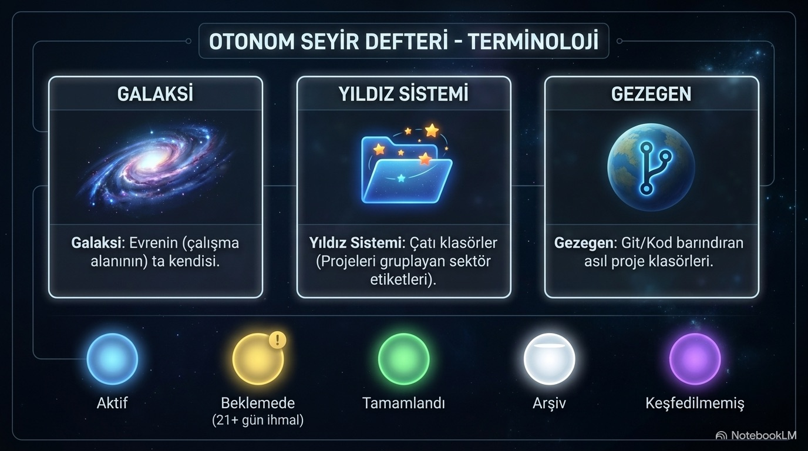</p>

| Kavram | Karşılığı |
|--------|-----------|
| **Galaksi** | Evrenin (çalışma alanının) kendisi — seçtiğin bir kök klasör. |
| **Yıldız sistemi** | Projeleri gruplayan çatı klasör (kendi `.git`'i yok ama içinde git projeleri var). Kendisi gezegen olmaz; içindeki her proje onun gezegeni olur, adı da grup etiketi olur. |
| **Gezegen** | **İçinde `.git` olan** asıl proje klasörü. |

> **Önemli:** Yalnızca **içinde `.git` olan** klasörler gezegen olarak gösterilir. Rastgele/çatı klasörler (indirmeler, geçici klasörler vb.) haritayı ve listeyi kirletmez. `.git`'i olan bir klasör her zaman **tek** gezegendir (monorepo kökü dahil); kendi `.git`'i yok ama alt klasörlerinde git deposu olan → yıldız sistemi.

**Gezegen durumu (renk):** 🔵 aktif · 🟡 beklemede · 🟢 tamamlandı · ⚪ arşiv · 🟣 keşfedilmemiş.

---

## Arayüz turu

<p align="center">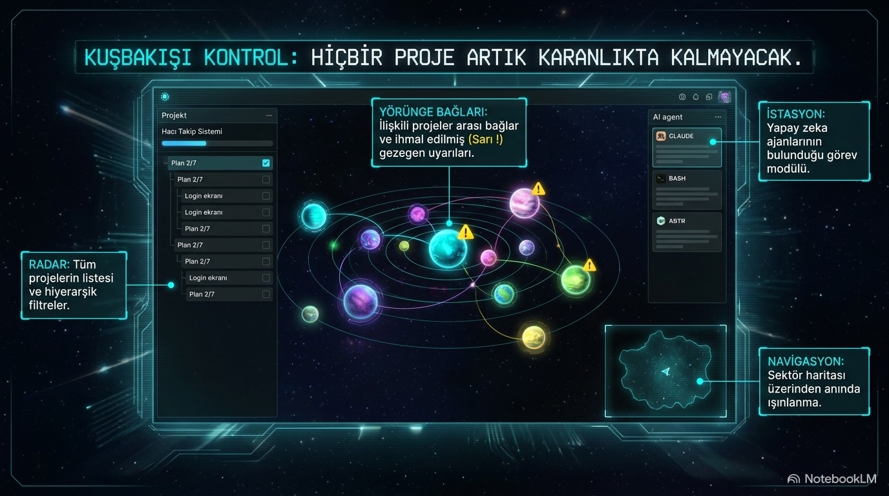</p>
<p align="center">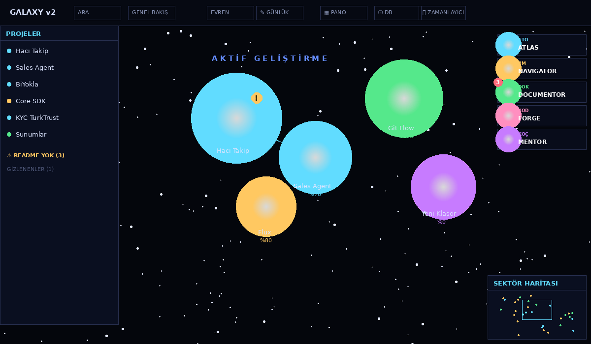</p>

### Üst bar & navigasyon

Soldan sağa:

- **GALAXY** logosu · gezegen modundayken **‹** (uzaya dön) düğmesi.
- **Konum breadcrumb'ı** — nerede olduğun her an bellidir: **🌌 Evren › 🪐 Gezegen ▾**. Tıkla → **hızlı geçiş anahtarı** açılır: üstte tüm **evrenler** (aktif olan işaretli), altta o evrenin **gezegenleri** (bulunduğun "buradasın" etiketiyle). Tek tıkla başka evrene/projeye ışınlan.
- **Segmentli sekme çubuğu** — 7 sekme (aşağıda): aktif sekme dolgulu vurguyla belirgindir.
- **◷ Saat** — canlı saat; tıkla → **İstasyon Araçları**.
- **⌕ Ara (⌘K)** — hızlı komut paleti: proje ara, komut çalıştır.
- **🚀 HUD** — alttaki gösterge panelini aç/kapat.
- **⚙ Ayarlar**.

### İstasyon Araçları

Üst bardaki **◷ saat** düğmesine tıkla — gün içi araçların tek panelde:

- **Canlı saat + tam tarih** (saniye saniye).
- **Mini takvim** — bugünü vurgular, ‹ › ile ay gezinme, başlığa tıkla → bugüne dön.
- **Hesap makinesi** — klavye + tuş takımı, C / ⌫ / =, güvenli değerlendirme (yalnız sayı/operatör/parantez/%).
- **Hızlı ara** — tüm gezegenlerde ada göre; seçince o gezegene ışınlar.

`Esc` ile kapanır. (⌘K komut paleti proje/komut aramasını sürdürür; İstasyon Araçları ise saat-takvim-hesap-hızlı erişim içindir.)

### Uzay modu — galaksi haritası

- **Galaksi görseli:** fareyle sürükle, tekerlekle yaklaş. WASD/oklar + / − ile de gezinilir.
- **Sol panel — PROJELER:** aktif evrenin gezegenleri, **son aktiviteye göre sıralı** (en taze üstte). Her satır: durum noktası + proje adı + **dal ve son aktivite** (`main · 2g önce`). Başlıkta proje sayısı. Git deposu yoksa net bir boş-durum mesajı çıkar.
- **Sağ istasyon:** 5 AI ajanın avatarları (üzerine gel → görev kartı, tıkla → sohbet).
- **GALAXY HUD (alt):** 🚀 ile aç. Üç kart: **En Aktif Yıldız** (son 30 günde en çok commit alan projen), **Son Yapılanlar** (+ RAPOR arşivi), **Notlarım** (hızlı not ekle). Panel taşarsa iç kısmı kaydırılır; içerik asla kırpılmaz.

### Gezegen modu — projenin içi

<p align="center">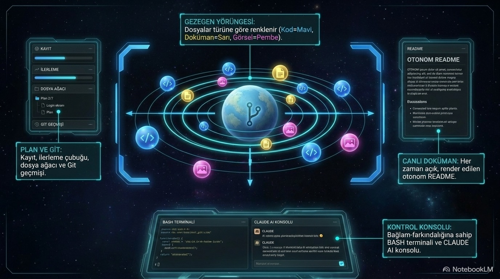</p>
<p align="center">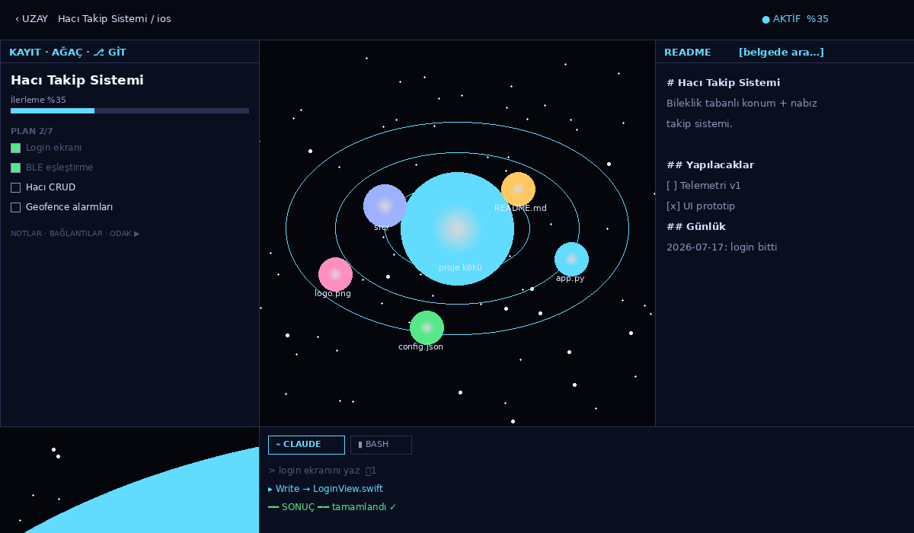</p>

- **Orta — dosya yörüngesi:** klasör = halkalı uydu (tıkla → içine dal), dosya = türüne göre renkli (kod mavi, doküman sarı, görsel pembe). Tıklayınca **uygulama içinde** açılır: kod, markdown, resim, PDF, video.
- **Sol panel, üç sekme:**
  - **KAYIT** — durum, ilerleme çubuğu, plan checklist'i (çift tıkla düzenle), notlar, **odak kronometresi** (süresi Ayarlar'dan), onaylı proje kaldırma, klasörü aç.
  - **AĞAÇ** — tam dosya ağacı.
  - **⎇ GİT** — canlı git paneli (aşağıda).
- **Sağ panel:** README her zaman açık, render'lı; içinde arama.
- **Alt konsol:** projeye özel, kalıcı terminal (aşağıda).

### Konsol — kalıcı bash + Claude oturumları

Alt kısımda, **başlıklı ayrı bir panel** olarak durur: **▮ TERMİNAL · \<proje\>** + `CLAUDE` / `BASH` sekmeleri + sağda **● oturum sürüyor** (canlı nabız). Giriş alanında **yanıp sönen imleç** komut beklediğini belli eder.

- **⌁ CLAUDE** — "şu bug'ı düzelt" yaz, Enter. Bu projenin klasöründe çalışır; dosya okur/yazar, komut çalıştırır. Oturum `claude --continue` ile sürer (kaldığın yerden devam). Ekran görüntüsü yapıştır (⌘V) ya da dosya sürükle.
- **▮ BASH** — gömülü terminal. `cd` / ortam değişkenleri oturum boyunca korunur, Tab ile tamamlama, ↑↓ komut geçmişi, ⇗ ile gerçek Terminal/iTerm'de aç.

> **Oturumlar projeye özel ve KALICI:** Bir projede komut çalıştırıp başka projeye geçtiğinde önceki oturum kapanmaz. Geri döndüğünde bash çıktın ve Claude sohbetin **kaldığın yerde** durur — her projenin kendi bağımsız oturumu vardır. Konsol tutamağını sürükleyerek yüksekliğini ayarlayabilirsin.

### 🔮 Galaxy Asistanı — dijital ikizin

Ekranın **sağ alt köşesinde**, parçacıklardan oluşan parlayan bir **asistan orbu** durur. Tıkla → asistan paneli açılır. Bu bir **dijital ikiz**: robotik bir komut kutusu değil, **insan gibi konuşan** kişisel bir asistan. Hem sohbet eder (hava, genel bilgi, tavsiye, günlük konuşma) hem de projede yaptığın her şeyi **yazarak** yaptırır.

- **Yazışarak konuş:** panele yaz, Enter'a bas. Yanıt **token token akar** (hece hece yazılır gibi). Cevaplar panelde kalır; oturum kaldığın yerden sürer.
- **Durum renkleri** — orb yaptığı işe göre renk değiştirir: **cyan** hazır · **mavi** çalışıyor.
- **Tam yetkili** — projede/uygulamada yapabileceğin her şeyi yaptırabilirsin:
  - **Gezinme:** "Core SDK projesine git", "Papilon evrenini aç", "uzaya dön".
  - **Sekme:** "Docker'ı aç", "veritabanını aç", "pano".
  - **Git:** "commit et [mesaj]", "push", "pull", "git durumu".
  - **Terminal:** "terminalde npm test çalıştır" → o projenin bash'inde çalıştırır, çıktıyı gösterir.
  - **Geliştirme + genel bilgi:** "login ekranındaki hatayı düzelt" ya da "bugün Ankara'da hava kaç derece" — kod işini yapar, genel soruları da (web araması dahil, tam izinli) yanıtlar.
- **Kalıcı hafıza:** sohbet geçmişi diske kaydedilir — uygulamayı kapatıp açsan da kaldığın yerden devam eder. Başlıktaki **✎** ile "yeni sohbet" başlatırsın (geçmiş + Claude oturumu sıfırlanır).
- **Kişilik / dijital ikiz:** Ayarlar → "Asistan kişiliği / hakkında" alanına kendini yaz (kim olduğun, tarzın, tercihlerin) → ikiz senin gibi konuşur.
- **Günlük brifing:** her gün ilk açılışta ikiz sana kısa bir durum özeti verir (ne durgun, ne bekliyor, bugün neye odaklan). İstediğinde "brifing" / "durum raporu" yaz.
- "Ne yapabilirsin?" dersen yeteneklerini sayar. `Esc` ile kapanır.

> **Not:** Sesli komut altyapısı (native macOS ses tanıma + "Hey Galaxy" uyandırma) kodda hazır ama şu an **kapalı** — asistan yalnız yazışma modunda. İstenirse tek ayarla geri açılır.

### GİT — canlı panel + Git Merkezi

Sol paneldeki **⎇ GİT** sekmesi artık pasif bir liste değil, **canlı bir kontrol** paneli:

- **Durum kartı:** hangi daldasın, **ahead/behind** (`↑2 ↓0`), ve "N değişiklik bekliyor / çalışma alanı temiz".
- **Hızlı aksiyonlar:** **Commit…** (Git Merkezi'ni açar) · **⬆ Push** · **⬇ Pull** (tek tık, canlı geri bildirim).
- **◷ Git Merkezi** butonu — tek net giriş; son commit tek satır özet. (Git deposu değilse `git init` yönlendirmesi.)

**Git Merkezi** dört sekmeli tam iş tezgahı:

<p align="center">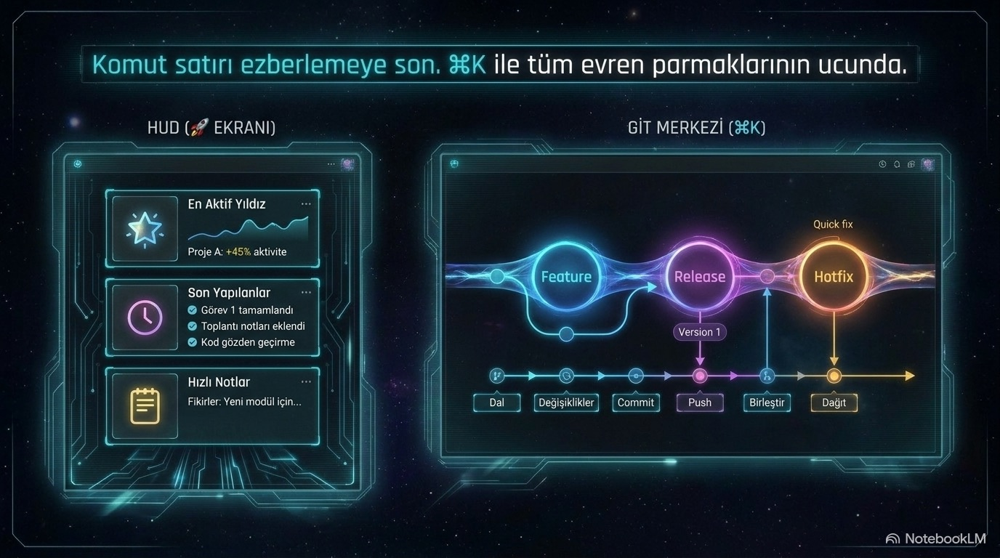</p>

- **DURUM** — dal değiştir/oluştur, dosyaları stage/unstage et, commit mesajı yaz → commit.
- **TAKIM AKIŞI** — senin o andaki gerçek durumuna göre (dal, bekleyen değişiklik, `develop` var mı) yazılan adım adım teslim akışı: gerekiyorsa `git stash` ile işini kaybetmeden feature dalına taşı, `feature/…` adı öner, küçük commit → `push -u` → **MR/PR aç** (kopyalanabilir açıklama şablonu) → rebase + `--force-with-lease` → birleştir + dal temizliği. Her komut kutusu tıklayınca panoya kopyalanır.
- **GEÇMİŞ** — günlere gruplu commit zaman çizelgesi + kim ne kadar katkı yapmış.
- **GIT FLOW REHBERİ** — git'i hiç bilmeyen biri için: şerit diyagramı (main/develop/feature/release/hotfix) + 6 adımda tüm döngü + kopyalanabilir komut sözlüğü (başlangıç, kaydetme, remote, geri alma, inceleme).

---

## Sekmeler

Üst bardaki segmentli çubuktan erişilir. Bir sekmeye geçince ilgili veri **otomatik tazelenir**.

### ▦ PANO — Kanban

Tüm todo'lar üç kolonda: **Bekliyor / Devam / Tamam**. Karttan ▸ GİT ile gezegene in, ⌁ ile Claude aç.

### ⛁ DB — Veritabanı gezgini

Postgres / MySQL / SQLite sunucularını ekle (parolalar macOS `safeStorage` ile şifreli) → sunucudaki tüm veritabanları → tablolar → satırlar. **Satır düzenle / ekle / sil**, **CSV dışa aktar**, **ŞEMA** düğmesiyle foreign key ilişkilerini kart diyagramı olarak çiz. Serbest SQL çalıştır: `SELECT` doğrudan çalışır; yazma işlemleri (INSERT/UPDATE/DELETE) **önce onay** ister ve denetim günlüğüne (🤖 ajan onaylıysa etiketle) yazılır.

### 🐳 DOCKER

- **Konteynerler:** çalışan + durmuş hepsi listelenir; **başlat / durdur / yeniden başlat / kaldır**, **canlı log akışı** ve konteyner içinde **komut çalıştır** (exec). Sekmeye her geçişte liste tazelenir; konteyner yoksa açıkça belirtilir.
- **İmajlar:** listele + sil.
- Motor kapalıysa **▸ Başlat** ile Docker Desktop'ı aç; `prune` ile temizle.

### ⏱ ZAMANLAYICI

"Her sabah 09:00'da ATLAS durum raporu hazırlasın" gibi görevler tanımla (haftalık/günlük, ajan seç). Görev çalışınca **çıktısı ekranda görünür**, rapor arşivine (`reports/`) düşer ve hangi sekmede olursan ol bildirim (toast) çıkar. ▸ ÇALIŞTIR ile elle de tetiklenir.

### 🖧 SUNUCULAR — Uzak / SSH

<p align="center">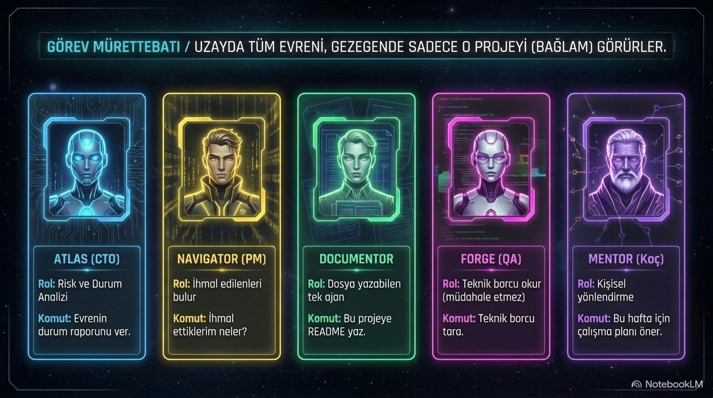</p>

- **Sunucu ekle/düzenle:** ad, host, kullanıcı, port, **anahtar seçici** (`~/.ssh` altındaki gerçek anahtarlar çip olarak listelenir). **Test et** bağlantıyı ve uzak kabuğu (POSIX/Windows) doğrular.
- **Uzak klasör → evren:** sunucudaki bir yolu (ör. `/root`, `/home/kullanıcı/projeler`) yaz → o klasör **uzak evren** olur; içindeki projeler tıpkı yerel gezegenler gibi haritaya çıkar (arka planda taranır, stale-while-revalidate önbellek).
- **Uzak terminal:** sunucuda gömülü terminal — **login kabuk** (`bash -l`) kullanır; böylece uzak `PATH` senin kendi terminalindekiyle aynıdır (docker/node/nvm/brew komutları bulunur).
- ControlMaster multiplexing, `accept-new` host-key politikası, yapılandırılabilir zaman aşımı (Ayarlar).

---

## Yapay zekâ ajanların

<p align="center">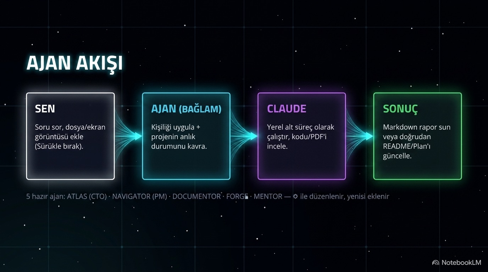</p>

Sağ üstteki istasyonda dururlar; üzerine gel → görev kartı, tıkla → konuşma paneli. **Uzaydayken tüm evrene, gezegen modundayken sadece o projeye** bakarlar (panelde BAĞLAM çipi).

| Ajan | Rolü | Ona ne dersin |
|------|------|----------------|
| 🔵 **ATLAS** | CTO | "İş evreninin durum raporunu ver", "Risk analizi yap" |
| 🟡 **NAVIGATOR** | PM | "Standup", "İhmal ettiklerim neler?" — rozetinde uyarı sayısı birikir |
| 🟢 **DOCUMENTOR** | Dokümantasyon | "Bu projeye README yaz" — dosya yazabilen tek ajan |
| 🩷 **FORGE** | Kod kalitesi | "Teknik borcu tara" — okur ama asla değiştirmez |
| 🟣 **MENTOR** | Kişisel koç | "Bu hafta için çalışma planı öner" |

⚙ ile adlarını, renklerini, görev tanımlarını, hazır komut düğmelerini düzenle; yeni ajan ekle. Ajanlar `claude -p --output-format stream-json` alt süreci olarak akar.

### Günlük iş akışın (Otonom README döngüsü)

<p align="center">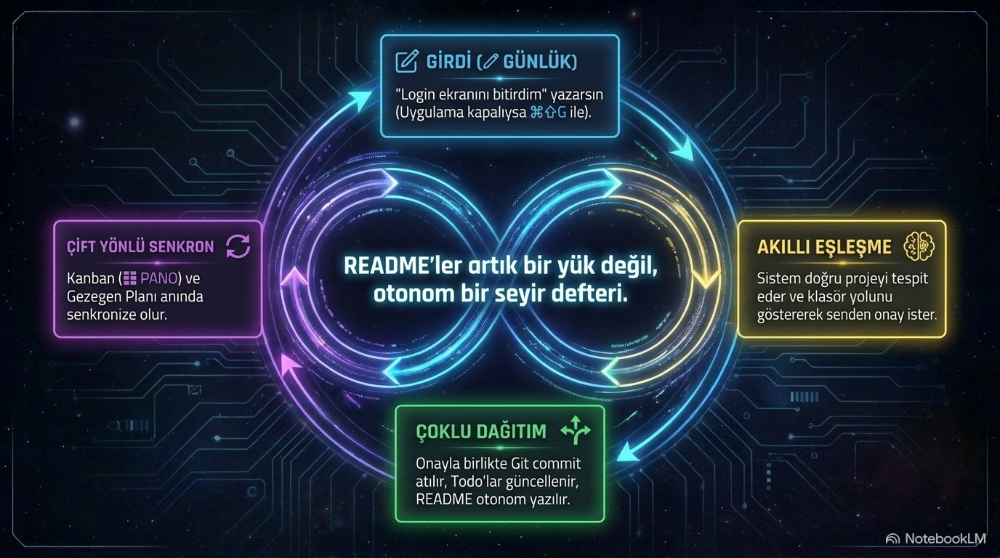</p>

**✎ GÜNLÜK:** "login ekranını bitirdim" yaz → uygulama hangi projeyle ilgili olduğunu bulur → **klasör yolunu göstererek onayını ister** → yapılan iş README `## Günlük`e, yapılacak iş `## Yapılacaklar`a ve plana işlenir. README'deki `- [ ]` maddeleri gezegene girince plana aktarılır — çift yönlü senkron. **⌘⇧G** ile uygulama kapalıyken menü çubuğundan hızlı not.

---

## Ayarlar

⚙ (HUD dişlisi / tray / ⌘K) — artık yalnız profil değil, gerçek araç yapılandırması:

| Ayar | Ne işe yarar |
|------|--------------|
| **Ad / Hitap** | Ajanların sana seslenişi. |
| **Dil** | TR / EN (arayüz + ajan varsayılanları). |
| **İhmal uyarısı (gün)** | Bu süreden eski aktif projeler uyarı üretir. |
| **Plan uyarısı (madde)** | Bekleyen plan maddesi eşiği. |
| **Claude komut yolu** | Boşsa PATH'ten; ya da tam yol (ör. `/opt/homebrew/bin/claude`). Tüm Claude çağrılarına uygulanır. |
| **Terminal uygulaması** | Terminal.app / iTerm — "gerçek terminalde aç" bunu kullanır. |
| **Odak süresi (dk)** | Pomodoro kronometresinin varsayılanı. |
| **SSH zaman aşımı (sn)** | Uzak bağlantı `ConnectTimeout`. |
| **Asistan kişiliği / hakkında** | Dijital ikizine kendini tanıt — senin tarzınla konuşsun. |

Yedeklerden geri dönüş: ⌘K → Yedekler.

---

## Kısayollar

<p align="center">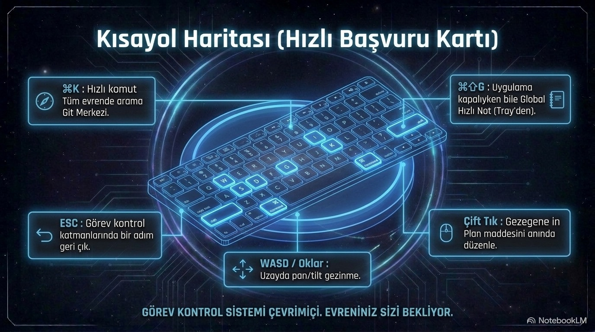</p>

| | |
|---|---|
| **F1** / **⌘/** | Seyir Rehberi (görselli tanıtım + kullanım) |
| **⌘K** | Hızlı komut: proje ara, Git Merkezi, ayarlar, yedekler |
| **◷ (üst bar)** | İstasyon Araçları: saat · takvim · hesap · hızlı ara |
| **🌌 breadcrumb** | Konum switcher: evren/gezegen değiştir |
| **ESC** | Katman katman geri (araçlar → switcher → paneller → uzay) |
| **Enter** | Gönder/çalıştır · **Shift+Enter** yeni satır · **⌘Enter** commit |
| **⌘⇧G** | Her yerden hızlı not |
| **Çift tık** | Gezegene in · plan maddesi düzenle |
| **↑ ↓** | Bash komut geçmişi · **Tab** tamamlama · **⌫** üst klasör |
| **WASD / oklar, + / −, ⌂** | Uzayda gezinme |

---

## Verilerim güvende mi?

<p align="center">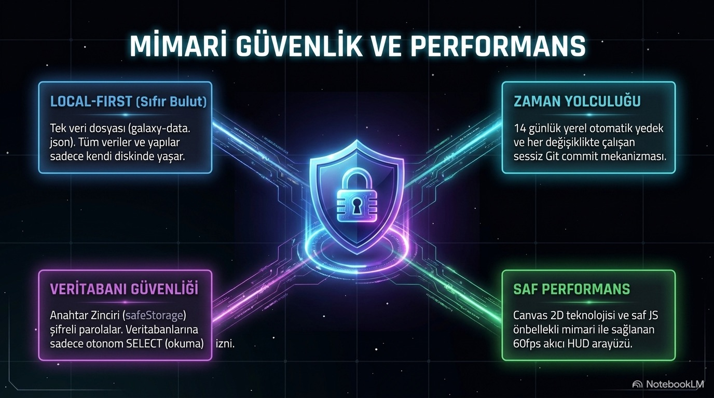</p>

- **Her şey diskinde:** tek veri dosyası `galaxy-data.json`, konum `~/Library/Application Support/ProjectGalaxy/`. Hiçbir bulut yok. (Eski sürümden geliyorsan verin ilk açılışta otomatik taşınır.)
- Her gün otomatik yedek (`backups/`, 14 gün) + her değişiklikte sessiz **git commit** — `git log` ile zaman yolculuğu.
- Proje silme iki aşamalı onaylıdır ve en kötü ihtimalle macOS Çöp Kutusu'na gider; kalıcı silme yoktur.
- DB parolaları `safeStorage` ile şifrelenir; DB yazma işlemleri onaylı ve denetim günlüğüne yazılır.
- SSH anahtarların uygulamaya kopyalanmaz — `~/.ssh` altındakiler doğrudan kullanılır; verilen anahtar dosyası yoksa ssh-agent'a düşülür.

---

## Sık sorulanlar

**Uygulama açılmıyor / "Apple could not verify…" diyor.** İmzasız (ad-hoc) derleme olduğu için macOS engelliyor — normaldir. **Move to Trash deme, Done de.** Sonra Terminal'de karantinayı temizle (tek seferlik):
```bash
xattr -cr /Applications/"Project Galaxy.app"    # ya da ~/Downloads/"Project Galaxy.app"
```
Terminal istemezsen: **Sistem Ayarları → Gizlilik ve Güvenlik** → aşağıda *"engellendi"* → **Yine de Aç**. (macOS 15'te eski "sağ tık → Aç" çalışmaz.) Ayrıca `node -v` / `bun -v` ile motorun kurulu olduğunu doğrula.

**Ajanlar / ⌁ CLAUDE "claude bulunamadı" diyor.** Kurulum Adım 2'yi yap; `claude` yazıp giriş yaptığından emin ol. Gerekirse **Ayarlar → Claude komut yolu**'na tam yolu gir.

**Yeni eklediğim klasör görünmüyor.** İçinde `.git` var mı? Yalnız git depoları gezegen olur. 60 sn bekle ya da pencereye tıkla (odaklanınca tarar).

**Sol listede eskiden gördüğüm klasörler kayboldu.** Kasıtlı: artık yalnız `.git` içeren gerçek projeler gösteriliyor. Bir klasörü göstermek istiyorsan içinde `git init` çalıştır.

**Docker konteynerlerim listelenmiyor.** DOCKER sekmesine geç (açılışta tazelenir) ya da **⟳ Yenile**'ye bas. Gerçekten konteyner yoksa panel bunu açıkça yazar. Motor kapalıysa **▸ Başlat**.

**Uzak sunucuya bağlanamıyorum / komutlar bulunamıyor.** Sunucu **Test et** ile doğrulanıyor mu? Uzak terminal login kabuk kullanır; yine de eksik komut olursa sunucudaki `~/.bash_profile` PATH'ini kontrol et. Anahtar alanına **host adı değil, `~/.ssh` altındaki gerçek anahtar dosyası** yazılmalı (çipe tıkla).

**Terminalde önceki oturumum kayboluyor mu?** Hayır — oturumlar projeye özel ve kalıcıdır. Projeler arası geçince kaldığın yerden devam edersin.

**vim/top gömülü terminalde çalışmıyor.** Doğru — o bir komut yürütücü; tam ekran programlar için ⇗ ile gerçek Terminal'i aç.

**Onboarding'i tekrar görmek istiyorum.** `galaxy-data.json` içindeki `"profile"` bölümünü sil, uygulamayı yeniden aç.

**App Store sürümüyle DMG sürümü arasındaki fark ne?** App Store (MAS) sürümü Apple sandbox'ı içinde çalışır: ajanlar, ⌁ CLAUDE, ▮ BASH, Docker ve SSH orada devre dışıdır; harita, gezegen modu, git panelleri, todo/pano ve DB görüntüleyici çalışır. Tüm özellikler için DMG (doğrudan indirilen) sürümü kullan. Ayrıntı: `docs/RELEASE.md`.

---

## Klasör yapısı & mimari (meraklısına)

```
ProjectGalaxy/                       (kod)
├── main.js                          # Electron ana süreç — tarama, git, ajanlar, DB, Docker, SSH, zamanlayıcı (106 IPC handler)
├── preload.js                       # Güvenli köprü (window.galaxy.*)
├── newui/                           # GERÇEK ARAYÜZ (uygulamanın yüklediği)
│   ├── preview-sample.html          #   şablon (dc template sözdizimi)
│   ├── component.js                 #   arayüz mantığı (class Component extends DCLogic)
│   ├── build.py                     #   derleyici → newui/index.html
│   └── index.html                   #   derlenmiş çıktı (elle düzenleme; build.py üretir)
├── onboarding.html                  # İlk açılış + Ayarlar penceresi (?mode=settings)
├── galaxy-hud.js                    # Eski HUD katmanı (geçmiş sürüm)
├── assets/guide/                    # Tanıtım infografikleri + mürettebat portreleri
├── docs/                            # Görseller + DEPLOYMENT.md / RELEASE.md / REMOTE-SSH.md
├── build/                           # ikon, tray, entitlements (DMG + MAS)
├── Başlat.command                   # paketlemeden çalıştır
└── create_app.command               # kişisel paketleyici (bun/node otomatik, ad-hoc imza)

~/Library/Application Support/ProjectGalaxy/   (veri — koddan ayrı yaşar)
├── galaxy-data.json                 # TÜM verin — tek kaynak
└── backups/  reports/  attachments/
```

**Teknik notlar:** Arayüz proprietary `dc-runtime` bileşen çatısıyla yazılır; `newui/build.py`, `preview-sample.html` + `component.js`'ten `index.html` üretir. Galaksi arka planı WebGL (three.js) ile ayrı katmanda çizilir, bu yüzden arayüz yeniden render'ları 3D'yi etkilemez. Git bilgisi süreç başlatmadan `.git` dosyalarından okunur; ahead/behind `git rev-list` ile hesaplanır. Yerel/uzak kabuklar `SHELL_SENTINEL` ile komut bitişini yakalar; konsol çıktısı ve oturumları **proje bazlı** tutulur (`_consoles[pid]`, `_claudeSess[pid]`). DB sürücüleri saf JS (pg/mysql2/sql.js). Paketleyici `@electron/packager` (node v26 bozuk olduğundan bun tercih edilir); dağıtım ad-hoc imzalı zip (`xattr -cr` ile açılır).

---

## Sürüm notları — bu sürümde neler değişti

**v2.3.9 öne çıkanlar**

- **Yeni: Otomatik güncelleme** — GitHub Releases'ten sürüm denetimi; yeni sürüm çıkınca üstte "🚀 İndir" bildirimi (tray'den elle de denetlenir).
- **Yeni: İkiz kişiliği + kalıcı hafıza** — Ayarlar'da "hakkında" alanı (ikiz senin tarzınla konuşur) + sohbet geçmişi diske kaydedilir + "yeni sohbet".
- **Yeni: Günlük durum brifingi** — her sabah ikiz tüm projelerini özetler (durgun/bekleyen/odak).
- **Yeni: Regresyon smoke-test** — her paketlemeden önce otomatik boot+akış testi (`npm test`), bozuk sürüm çıkmaz.
- **Yeni: 🔮 Galaxy Asistanı (dijital ikiz)** — sağ alttaki parçacık orbuna tıkla; yazışarak projede her şeyi yaptır (evren/proje/sekme aç, git, terminal, geliştirme) ve genel soruları sor. İnsan gibi konuşan kişilik, tam yetkili aksiyonlar, token-token akan yanıt. (Sesli komut altyapısı hazır ama şimdilik kapalı.)
- **Yeni: İstasyon Araçları** — üst bardan canlı saat, mini takvim, hesap makinesi ve gezegen hızlı arama.
- **Yeni: Konum breadcrumb + hızlı geçiş anahtarı** — nerede olduğun net; evren/gezegen değişimi tek tık.
- **Kalıcı, projeye özel konsol oturumları** — bash ve Claude projeler arası geçişte kapanmaz; her projede kaldığın yerden devam. Başlıklı terminal paneli + "oturum sürüyor" göstergesi + yanıp sönen imleç.
- **Yalnız git projeleri gezegen** — `.git`'i olmayan klasörler artık gösterilmez; sol liste "ad + dal + son aktivite" ile anlamlı, son aktiviteye göre sıralı.
- **Zenginleştirilmiş GİT** — canlı durum kartı (ahead/behind), hızlı Commit/Push/Pull, tek Git Merkezi girişi; tekrarlar kaldırıldı.
- **Genişletilmiş Ayarlar** — Claude yolu, terminal uygulaması, odak süresi, SSH zaman aşımı (hepsi bağlı).
- **Docker** — sekme açılınca otomatik tazelenir, durmuş konteynerler de listelenir, boş-durum mesajı.
- **Zamanlayıcı** — görev çıktısı artık arayüzde görünür + bildirim.
- **Uzak SSH** — login kabuk (doğru PATH), evren ekleme akışı sadeleşti.
- **UX/erişilebilirlik** — segmentli navigasyon, HUD kırpılması giderildi, kontrast ve konsol boş-durumları iyileştirildi.

## Sürüm çıkarma (otomatik — CI/CD)

Artık elle paketleme yok. GitHub Actions hallediyor:

- **Her push/PR** → `.github/workflows/ci.yml` arayüzü derler + smoke test çalıştırır (bozuk kod erken yakalanır).
- **Yeni sürüm çıkarmak için** tek komut — bir versiyon tag'i push et:
  ```bash
  npm version patch          # package.json'ı 2.3.9 → 2.3.10 yapar + commit + tag
  git push --follow-tags     # tag'i gönder → CI devreye girer
  ```
  `.github/workflows/release.yml` macOS'ta build + smoke + paketler ve **GitHub Release**'i `Project-Galaxy-full.zip` ekiyle otomatik yayınlar. Arkadaşlarının uygulaması bunu görüp "🚀 İndir" bildirimi gösterir.
- Elle paketleme hâlâ mümkün: `bash scripts/package-mac.sh` (CI ile aynı script) ya da `create_app.command`.

Ek notlar: `docs/DEPLOYMENT.md` · hesap/sertifika ve DMG yolu: `docs/RELEASE.md` · uzak SSH: `docs/REMOTE-SSH.md`.
